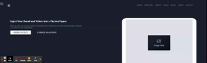

  

<h1 align="center">Hi 👋, I'm Parlier Thierry</h1>
<h3 align="center">A passionate software engineer from Reunion Island, France ( near Mauritius )</h3>

 

  

- 🔭 I’m currently working on [my portfolio](https://thierryparlier.netlify.app)

- 🌱 I’m currently digging more on **Figma, React, TypeScript and more of Javascript**

- 👯 I’m looking to collaborate on [Gitconnected](https://git-connected.herokuapp.com/)

- 👨‍💻 All of my projects are available at [https://github.com/Angra974](https://github.com/Angra974)

- 📫 How to reach me **dev.thierryparlier@gmail.com** or connect with me with social media

- 📄 Know about my experiences [https://thierryparlier.netlify.app](https://thierryparlier.netlify.app)

- ⚡ Fun fact **Chuck Norris is a backend dev**

---

### 🛠 &nbsp;Languages and Tools :

&nbsp;
&nbsp;
&nbsp;
&nbsp;
&nbsp;
&nbsp;
&nbsp;
&nbsp;
&nbsp;
&nbsp;
&nbsp;
&nbsp;
&nbsp;
&nbsp;

---

<h2 align="center">Highlighted Projects </h2>

<table>
<tr>
<td width="50%" align="center" >
<h3 color="white">Level ground</h2>

  

  

&nbsp;
&nbsp;

</td>

<td width="50%" align="center" >
<h3 color="white">Home wireframe</h2>

  

&nbsp;
&nbsp;

</td>
</tr>
<tr>
<td width="50%" align="center" >
<h3 color="white">Restaurant</h2>

  

  

&nbsp;
&nbsp;

</td>

<td width="50%" align="center" >
<h3 color="white">Hair saloon</h2>

  
 
 

  

&nbsp;
&nbsp;

</td>
</tr>

<tr>
<td width="50%" align="center" >
<h3 color="white">FEM: Interactive component</h2>

  
 
 

  

&nbsp;
&nbsp;

</td>

<td width="50%" align="center" >
<h3 color="white">Cocktails</h2>

  
 
 

  

&nbsp;
&nbsp;

</td>

</tr>

</table>

<h3 align="left">Connect with me:</h3>

&nbsp;

